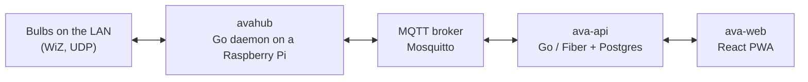

# Ava

Self-hosted control for the lights in your house.

Ava is a smart-home controller you run yourself. A small daemon on a Raspberry Pi
finds the bulbs on your network and drives them; a Go API keeps the state and the
accounts; a React app gives you a room, a switch and a colour pad. Nothing leaves
your network except what you choose to host.

It is multi-tenant, so one deployment can serve several homes, each with its own
members, rooms, hubs and scenes.

> **Status:** early. The wire protocol between hub and API is not yet stable —
> expect to update hubs alongside the server. There is no licence file yet, so
> the code is all rights reserved until one is added.

## How it fits together



Three deployables:

| | What it is | Runs on |
| --- | --- | --- |
| `ava-api` | Go (Fiber) API over Postgres; owns accounts, rooms, scenes and device state | a server |
| `ava-web` | React 19 PWA (Vite, TanStack Router/Query, Tailwind) | static hosting |
| `avahub` | Go daemon that discovers and drives the bulbs | a Raspberry Pi on the home LAN |

The hub never talks to the API directly for control traffic. It publishes state and
subscribes to commands over MQTT, and the API bridges that to the browser over a
websocket, so a change made on a phone reaches a bulb without polling.

A hub pairs using the RFC 8628 device authorization grant: it prints a code, you type
that code into the web app, and it receives its own tokens and broker credentials.
Each hub's broker account can only touch its own topics.

## Quick start

Prerequisites: **Go 1.26+**, **pnpm 11+** on **Node 24** (what CI builds with), and
**Docker** for Postgres and the MQTT broker.

```bash
git clone https://github.com/xenomech/ava.git
cd ava
make setup                                   # air, golangci-lint, gofumpt, lefthook
cp backend/services/api/.env.example backend/services/api/.env
cp frontend/apps/web/.env.example frontend/apps/web/.env
```

Edit `backend/services/api/.env` and set `MQTT_PASSWORD` — the broker refuses to
start without it. Then:

```bash
docker compose --env-file backend/services/api/.env up -d postgres mosquitto
make dev                                     # API on :8000, hot reload
pnpm -C frontend install && pnpm -C frontend dev:web   # web on :3000
```

Open <http://localhost:3000> and register with a name, email and password. Onboarding
then walks you through naming your home and pairing a hub. The database schema is
applied on boot; there is no migration step.

To point a hub at your local API, see [docs/self-hosting.md](docs/self-hosting.md).

## Documentation

| | |
| --- | --- |
| [Self-hosting](docs/self-hosting.md) | Running your own Ava, and installing a hub on a Raspberry Pi |
| [Contributing](CONTRIBUTING.md) | Development setup, branch model, conventions, tests |
| [Releasing](docs/releasing.md) | Cutting a release and promoting to production (maintainers) |

`docs/ava.postman_collection.json` is a Postman collection for the HTTP API.

## Repository layout

```
backend/
  pkg/              shared Go: logger, mqtt, wire (hub <-> api contract)
  services/api/     the API server
  services/hub/     avahub and avactl, the Raspberry Pi side
frontend/
  apps/web/         the React app
  packages/ui/      the component library and device artwork
  packages/contracts/  zod schemas shared by web and API
docker/             Mosquitto image and entrypoint
scripts/            install-hub.sh, the Raspberry Pi installer
```

The hub and the API are separate Go modules and must not import each other;
`make check-boundary` enforces it.

## Supported devices

WiZ bulbs today, discovered over UDP on the local network. Devices are modelled as
traits — `power`, `brightness`, `color_temp`, `color` — rather than as products, so
adding a vendor means writing an adapter that maps its protocol onto those traits.
